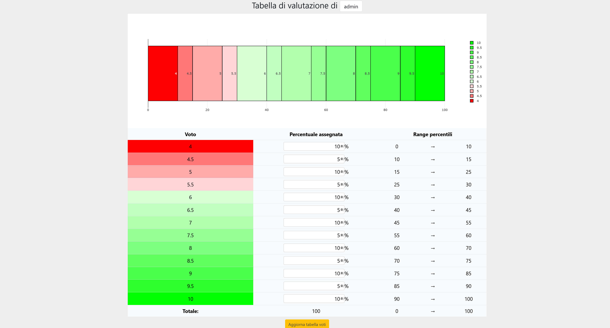
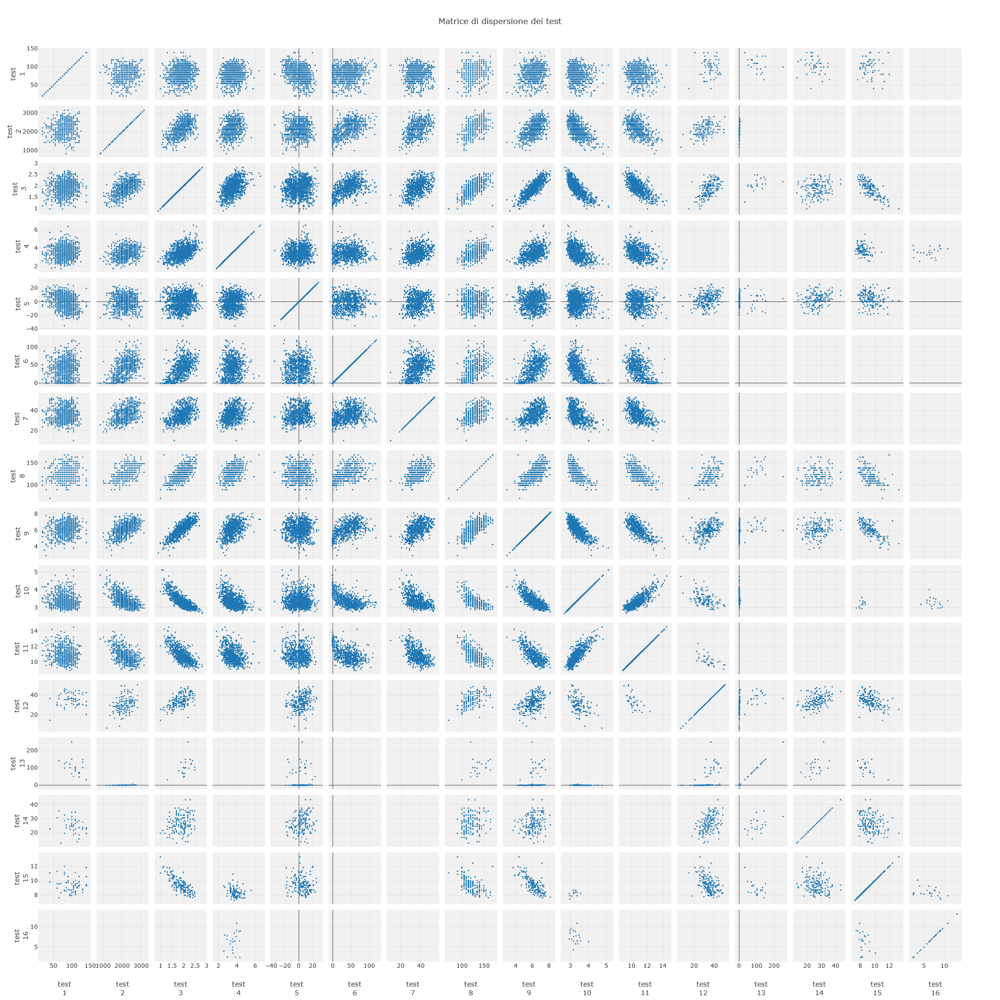

# progettoRAM
progettoRAM is an electronic register system with statistical functions for Physical Education Teachers; it consists in a web application available either on desktop or mobile.

## Functionalities
The system's functionalities are divided in different sections, available based on the type of user:
* Adminstrator: can access all functions
* Professor (Test management): can access to the register, test and statistics sections; moreover, can add or modify tests
* Professor: can access the register, tests and statistics
* Research: can access the statistical section and see the test parameters

Moreover, the statistical section's pages present a menu used to restrict the population based on:
* Years
* Classes
* Gender
* Personal values

### Register
This section presents functions related to the management and analysis of classes and students in the system:

* Display of the list of personal classes (or of all the registered ones, if the user is an administrator)
* Class management
	* Insertion and update of a new class; insertion of new students with:
		* Name and surname
		* Import from a previous class
		* Proposal of students already registered in the system
	* Deletion of students from a class
	* Deletion of classes
* Display of the register of a class
	* Display of the student list and their test results
	* Statistic analysis of test values
	* Insertion of a new test and update of previous values
		* Validation of inserted values through statistical functions
	* Test results processing (with optional population restrictions) to obtain:
		* Percentiles
		* Standard score
		* Grades
	* General statistic analysis on processed tests and color-coding of the results
* Display of a student's register
	* Display of the list of classes and tests
	* Statistic analysis as for the classes and plot visualization
* Student data update

### Tests and grade management
This section allows to manage tests and grades, either in general or for the active user, through the following functions:
* Insertion, update and deletion of tests in the system
* Test information display
* Update of favourite tests (i.e. that are proposed to the user when adding a new test in the register section)
* Management of the grading table
	* Display of the percentile range assigned to a grade through a plot
	* Update of the table
	* Administrative access to all users' tables

### Statistics
The statistics section allows the processing of the system's data; it offers:
* Display of test results based on
	* Test
	* Gender
	* Class
	* Year
* Display of statistics for each test:
	* Calculation of mean, median and standard deviation
	* Display of positive and negative records
	* Display of:
		* Value plot
		* Box plot
			* General
			* By year
			* By class
			* By gender
		* Percentiles plot
* Elaboration of correlation statistics for tests
	* Display and color-coding of correlation coefficients
	* Display of the tests' scatter plot matrix
	* Display of the plot for two tests

### Administration
The administration section offers tools for the management of the application's parameters:
* Log display (by day)
* Users management
	* Insertion of new users
	* User details display
	* Update of a user's privileges (if they are part of the administrator hierarchy)
* Management of registered schools
* Test parameters management; insertion, update and deletion of:
	* Units of measure
	* Test classes
	* Data types
* Management, through a simplified markup language, of:
	* The project's description page
	* Announcements in home page
* Union and separation of wrong student profiles

### Profile
The profile page allows to update personal information and, for administrators, decide the contact information to show in the guide.

### Guide
A guide is available to explain to the users how to use the application; only the relevant information is displayed, based on the user's privileges.

The guide is reported in the file [user_guide.pdf](user_guide.pdf) (in italian).

## System and software
The application has been used in different environments, as per the table:

|                   | Original and target system | Development environment      | Testing environment |
| ----------------- | -------------------------- | ---------------------------- | ------------------- | 
| Operating System  | Debian 8.11                | Windows 10 (XAMPP v3.2.4)    | Raspbian Linux 9    |
| Web Server        | Apache 2.4.10              | Apache 2.4.46                | Apache 2.4.25       |
| DBMS              | MySQL 5.5.62               | MySQL 8.0.22                 | MariaDB 10.1.48     |
| PHP               | 7.3.8                      | 7.4.11                       | 7.0.33              |

Dependencies versions (Also reported in [composer.json](src/composer.json)):

|                                                  | Version | Licence     |
| ------------------------------------------------ | ------- | ----------- |
| [Bootstrap](https://getbootstrap.com/)           | 5.0.0   | MIT License |
| [jQuery](https://jquery.com/)                    | 3.4.1   | MIT License |
| [fitty](https://github.com/rikschennink/fitty)   | 2.3.3   | MIT License |
| [Plotly.js](https://github.com/plotly/plotly.js) | 1.58.4  | MIT License |

## Deploy
In order to deploy the application, some steps are necessary:
* Repository download (from the [releases](https://github.com/rb-sl/progettoRAM/releases) section)
* Execution of [Composer](https://getcomposer.org/) in the `/src` folder
* Import of the MySQL database; for more informazioni access the [database README](database/README-en.md)
* Set up of a web server with document root `/src`
* Creation and (optional) update of the configuration; more information in the [source code README](src/README-en.md)

## Roadmap
Planned additions to the application:
* A page for ANOVA (ANalysis Of VAriance) studies in the statistics section
* Realization of a bash script to deploy the application

## Authors
[@rb-sl](https://github.com/rb-sl)

## License
This application is released under the [GNU Affero General Public License v3.0](LICENSE).

## Images
Register section

Sezione di gestione test e voti

Sezione statistica

