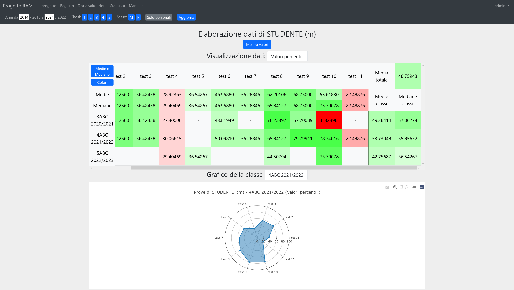

[English version](README-en.md)

# progettoRAM
Il progetto RAM (Ricerca Attività Motorie) è un sistema di registro elettronico con funzionalità statistiche per i professori di educazione fisica; consiste in un'applicazione web fruibile da desktop o mobile.

## Funzionalità
Le funzionalità del sistema si articolano su diverse sezioni, accessibili a diverse tipologie di utenti:
* Amministratore: può accedere a tutte le funzioni del sistema
* Professore (Gestione test): può accedere alle sezioni di registro, test e statistica e può aggiungere o modificare i test
* Professore: può accedere a registro, test e statistica
* Ricerca: può accedere alla sezione statistica e visualizzare i parametri dei test

Inoltre, le pagine statistiche presentano un menu utile a restringere la popolazione secondo:
* Anni
* Classi
* Sesso
* Valori personali

### Registro
Questa sezione presenta le funzioni di gestione e analisi di classi e studenti nel sistema:

* Visualizzazione dell'elenco delle classi personali (tutte se l'utente è amministratore)
* Gestione delle classi
	* Inserimento e modifica di una nuova classe; inserimento della lista di studenti tramite
		* Anagrafica 
		* Importazione da una classe precedente
		* Proposta di studenti già presenti nel sistema
	* Eliminazione di studenti da una classe
	* Eliminazione di classi
* Visualizzazione del registro di una classe
	* Visualizzazione dell'elenco di studenti e test con le relative prove
	* Calcolo di statistiche sui valori della classe
	* Inserimento di un nuovo test e modifica di prove precedenti
		* Controllo di validità dei valori inseriti tramite funzioni statistiche
	* Elaborazione delle prove (con possibile selezione della popolazione) per ottenere
		* Valori percentili
		* Valori standard
		* Voti
	* Elaborazione statistica generale sulle prove elaborate e codifica per colore dei risultati
* Visualizzazione del registro di uno studente
	* Visualizzazione dell'elenco delle classi e delle relative prove
	* Elaborazione statistica delle prove come per le classi e visualizzazione tramite grafico
* Modifica dell'anagrafica di uno studente

### Gestione test e voti
La sezione permette di gestire i test e i voti, sia in generale sia per l'utente attivo tramite funzioni di:

* Inserimento, modifica ed eliminazione dei test nel sistema
* Visualizzazione delle informazioni dei test
* Modifica dei test preferiti (ovvero che appaiono nella pagina di inserimento prove del registro)
* Gestione della tabella di valutazione
	* Visualizzazione tramite grafico del range di assegnamento di un voto
	* Modifica della tabella di valutazione in base ai percentili
	* Visualizzazione amministrativa delle tabelle di tutti gli utenti

### Statistica
La sezione statistica permette di elaborare i dati presenti nell'applicazione; offre funzionalità di:

* Visualizzazione del numero di prove suddivise per
	* Test
	* Sesso
	* Classe
	* Anno
* Visualizzazione delle statistiche per ogni test
	* Calcolo di media, mediana e deviazione standard
	* Visualizzazione record positivi e negativi
	* Grafici:
		* Valori
		* Box plot
			* Generale
			* Per anno
			* Per classe
			* Per sesso
		* Valori percentili
* Calcolo delle statistiche di correlazione tra i test
	* Visualizzazione e codifica per colore dei coefficienti di correlazione 
	* Calcolo e visualizzazione della matrice di dispersione dei test
	* Visualizzazione del diagramma di dispersione tra due test

### Amministrazione
La sezione amministrativa fornisce funzioni utili alla gestione dei parametri dell'applicazione:

* Visualizzazione dei log di utilizzo suddivisi per giorno
* Gestione utenti
	* Inserimento di nuovi utenti
	* Visualizzazione dettagli
	* Modifica dei privilegi di accesso di un utente se nella propria gerarchia di permessi
* Gestione delle scuole nel sistema
* Gestione parametri dei test; inserimento, modifica ed eliminazione di
	* Unità di misura
	* Classi dei test
	* Tipi di dati
* Gestione, tramite un linguaggio di markup semplificato:
	* Del testo di descrizione nella pagina Il progetto
	* Degli annunci in home page
* Unione e separazione di profili di studenti errati

### Profilo
La pagina di profilo permette di aggiornare le informazioni personali e, per gli amministratori, decidere quali informazioni di contatto mostrare nella guida.

### Manuale
È infine disponibile un manuale per gli utenti che spiega come utilizzare il sistema. Le informazioni riportate sono basate sui privilegi di accesso dell'utente.

La guida è riportata interamente nel file [user_guide.pdf](user_guide.pdf).

## Sistema e software
Il sistema è stato utilizzato in diversi ambienti secondo la tabella:

|                   | Sistema originale e obiettivo | Ambiente di sviluppo      | Ambiente di test |
| ----------------- | ----------------------------- | ------------------------- | ---------------- | 
| Sistema operativo | Debian 8.11                   | Windows 10 (XAMPP v3.2.4) | Raspbian Linux 9 |
| Web Server        | Apache 2.4.10                 | Apache 2.4.46             | Apache 2.4.25    |
| DBMS              | MySQL 5.5.62                  | MySQL 8.0.22              | MariaDB 10.1.48  |
| PHP               | 7.3.8                         | 7.4.11                    | 7.0.33           |

Le versioni delle dipendenze sono (riportate anche in [composer.json](src/composer.json)):

|                                                  | Versione | Licenza     |
| ------------------------------------------------ | -------- | ----------- |
| [Bootstrap](https://getbootstrap.com/)           | 5.0.0    | MIT License |
| [jQuery](https://jquery.com/)                    | 3.4.1    | MIT License |
| [fitty](https://github.com/rikschennink/fitty)   | 2.3.3    | MIT License |
| [Plotly.js](https://github.com/plotly/plotly.js) | 1.58.4   | MIT License |

## Deploy
Al fine di effettuare il deploy dell'applicazione su un server sono necessari alcuni passaggi:
* Download della repository (dalla sezione [releases](https://github.com/rb-sl/progettoRAM/releases))
* Esecuzione di [Composer](https://getcomposer.org/) in `/src`
* Importazione del database MySQL; maggiori informazioni nel [README del database](database/README.md)
* Impostazione di un server web con Document root `/src`
* Creazione e modifica delle configurazioni dei file; maggiori informazioni nel [README del codice sorgente](src/README.md)

Prestare sempre attenzione ai permessi delle varie cartelle.

## Roadmap
Alcune future aggiunte per l'applicazione:
* Aggiunta di una pagina per l'analisi di varianza nella sezione statistica
* Realizzazione di uno script bash per il deploy

## Autori
[@rb-sl](https://github.com/rb-sl)

## Licenza
Questa applicazione è rilasciata con la [GNU Affero General Public License v3.0](LICENSE).

## Immagini
Sezione di registro

Sezione di gestione test e voti

Sezione statistica

