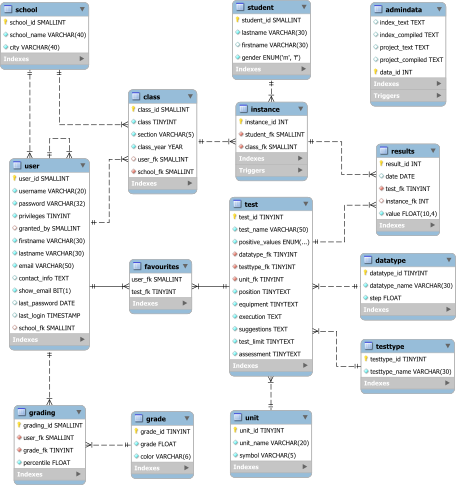

[English version](README-en.md)
# Database dell'applicazione

## Creazione di una nuova istanza del database
La struttura del database è esportata nel file [progettoRAM.sql](progettoRAM.sql). Il codice contiene già alcuni dati per:
* `admindata`: i testi sono preimpostati vuoti
* `datatype`: sono inseriti i tipi di dati per Interi, Frazionari e a Passo 5
* `grade`: sono preimpostati i voti e i loro colori
* `grading`: è inserita la tabella di valutazione di default per il primo utente
* `testtype`: sono inseriti alcuni tipi di test
* `unit`: sono preimpostate le unità più comuni
* `user`: È già inserito l'utente `admin`

Modificare alla riga `508` il parametro `$PASSWORD` con un valore a scelta per permettere l'accesso del primo utente con accesso amministrativo; le altre informazioni saranno modificabili dalla pagina di profilo.

Per creare il database è sufficiente importare il file `progettoRAM.sql` nel DBMS MySQL.

## Descrizione del modello

### User
La tabella `user` contiene le informazioni degli utenti dell'applicazione; i campi sono:
* `user_id`: Identificativo dell'utente (PK)
* `username`: Nome utente (UQ)
* `password`: La password dell'utente (Sotto hash MD5)
* `privileges`: Illustra il livello di accesso all'applicazione per l'utente
* `granted_by`: Campo utile a conoscere la gerarchia di assegnazione dei privilegi
* `firstname`: Nome dell'utente
* `lastname`: Cognome dell'utente
* `email`: Indirizzo di contatto per l'utente
* `contact_info`: Ulteriori informazioni di contatto (per un amministratore)
* `show_email`: Flag che determina se l'email dell'utente (se amministratore) viene mostrata nella guida
* `last_password`: Data dell'ultimo cambio di password dell'utente
* `last_login`: Accesso più recente
* `school_fk`: Chiave esterna verso la scuola di appartenenza (Può essere `NULL`)

### Grade
La tabella `grade` contiene i voti assegnabili dal sistema:
* `grade_id`: Identificativo del voto (PK)
* `grade`: Voto (UQ)
* `color`: Il colore con cui sono mostrati i voti e i valori percentili o standard ad esso associati

### Grading
`grading` è la tabella ponte tra `user` e `grade`; associa a un utente la sua tabella di valutazione:
* `grading_id`: Identificativo della tupla (PK)
* `user_fk`: Utente proprietario della tabella
* `grade_fk`: Voto
* `percentile`: Valore percentile massimo assegnato al voto

La coppia `user_fk` e `grade_fk` costituisce una chiave unica.

### School
La tabella `school` contiene informazioni sulle scuole che utilizzano l'applicazione:
* `school_id`: Id della scuola (PK)
* `school_name`: Nome della scuola
* `city`: Città della scuola

### Class
In `class` vengono registrate le classi del sistema con i loro dati:
* `class_id`: Id della classe (PK)
* `class`: Numero della classe
* `section`: Sezione
* `class_year`: Anno scolastico
* `user_fk`: Utente proprietario della classe
* `school_fk`: Scuola di cui è parte la classe

I campi `class`, `section`, `class_year` e `school_fk` costituiscono chiave unica.

### Student
La tabella `student` contiene l'anagrafica degli studenti:
* `student_id`: Identificativo dello studente (PK)
* `lastname`: Cognome dello studente
* `firstname`: Nome dello studente
* `gender`: Sesso dello studente

### Instance
La tabella `instance` rappresenta il ponte tra `student` e `class`, collegando ogni studente a tutte le sue classi. Contiene:
* `instance_id`: Identificativo dell'istanza (PK)
* `student_fk`: Chiave esterna
* `class_fk`: Chiave esterna verso la classe

`student_fk` e `class_fk` formano una chiave unica.

### Results
`results` contiene i risultati delle prove di test:
* `result_id`: Identificativo del risultato (PK)
* `date`: Data della prova del test
* `test_fk`: Chiave esterna per il test cui appartiene la prova
* `instance_fk`: Chiave esterna per l'istanza dello studente associata
* `value`: risultato della prova

È definita una chiave unica con `test_fk` e `instance_fk`.

### Test
* `test_id`: Identificativo del test (PK)
* `test_name`: Nome del test (UQ)
* `positive_values`: Indica se i valori migliori sono maggiori o minori
* `datatype_fk`: Chiave esterna per il tipo di dati del test
* `testtype_fk`: Chiave esterna per il tipo di test
* `unit_fk`: Chiave esterna per l'unità di misura
* `position`: Indicazioni per la posizione dello studente
* `equipment`: Indicazioni sull'equipaggiamento da utilizzare per il test
* `execution`: Indicazioni per l'esecuzione del test
* `suggestions`: Suggerimenti per l'insegnante
* `test_limit`: Descrizione del limite massimo del test
* `assessment`: Indicazioni su come debba essere valutato il test (ovvero cosa inserire nel database)

### Data type
La tabella `data_type` contiene i tipi di dati associati ai test:
* `datatype_id`: Identificativo del tipo di dato (PK)
* `datatype_name`: Nome che appare nelle descrizioni dei test
* `step`: Passo per cui vengono validati i risultati inseriti

### Test type
La tabella `testtype` indica le classi di test presenti nel sistema:
* `testtype_id`: Identificativo del tipo di test (PK)
* `datatype_name`: Nome del tipo di test

### Unit
Nella tabella `unit` sono salvate le unità di misura disponibili:
* `unit_id`: Identificativo dell'unità (PK)
* `unit_name`: Nome dell'unità
* `symbol`: Simbolo dell'unità

### Favourites
La tabella `favourites` associa un utente ai suoi test preferiti; contiene:
* `user_fk`: Utente
* `test_fk`: Test preferito

I due campi costituiscono chiave primaria.

### Admin data
La tabella `admindata` contiene una sola tupla ed è utilizzata per sfruttare le proprietà di concorrenza del database; mantiene i testi modificabili dagli amministratori per gli annunci in home e per la pagina Il progetto:
* `index_text`: Testo inserito per il messaggio in home
* `index_compiled`: Testo del messaggio in home tradotto in HTML
* `project_text`: Testo inserito per la pagina di progetto
* `project_compiled`: Testo della pagina Il progetto tradotto in HTML
* `data_id`: Chiave primaria per la tupla

## Trigger
Al fine di mantenere alcune proprietà del database sono definiti i seguenti trigger:
* `ADMINDATA_COUNT` e `ADMINDATA_ABORT_DELETE`: servono a mantenere una sola tupla all'interno di `admindata`
* `DELETE_ST_ON_NO_INST` e `DEL_ST_ON_NO_INST_UPDATE`: quando tutte le istanze di uno studente vengono eliminate, anche la tupla dello studente è rimossa (rispettivamente su delete e update della tabella `instance`)
* `NO_INST_SAME_YEAR` e `NO_INST_SAME_YEAR_UPDATE`: segnalano un errore nel caso uno studente sia registrato a più classi nello stesso anno
