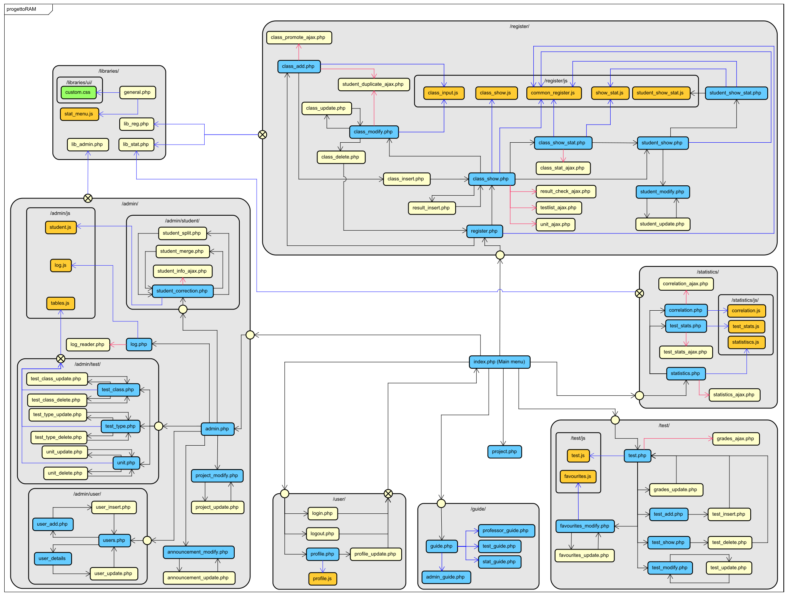

[English version](README-en.md)

# progettoRAM - Codice sorgente
In questa cartella è riportato il codice sorgente dell'applicazione, e corrisponde alla cartella root del server web.

Le descrizioni dei file e delle loro funzioni sono disponibili al termine di questo file e nei README delle sezioni:
* [Amministrazione](admin/README.md)
* [Librerie](libraries/README.md)
* [Registro](register/README.md)
* [Statistica](statistics/README.md)
* [Test](test/README.md)
* [Utente](user/README.md)

È riportata anche la guida utente come appare nell'applicazione nel file [user_guide.pdf](../user_guide.pdf).

## Struttura dell'applicazione


L'immagine mostra la struttura dei file dell'applicazione, codificati secondo colore:
* Blu: script con componenti front-end
* Giallo: script back-end
* Arancione: file di sorgente JavaScript
* Verde: file di sorgente CSS

Anche le relazioni tra i file sono codificate con frecce di colore:
* Nero: link o redirect
* Blu: inclusione
* Rosso: chiamata asincrona

Non sono mostrate le relazioni di inclusione per `general.php`, utilizzata in tutte le pagine.

## Deploy e file da aggiungere o modificare
Affinché l'applicazione funzioni correttamente sono necessarie alcune impostazioni aggiuntive, dopo aver impostato il server web (es. Apache) con root folder la cartella `src`.

### server_conf.json
In una cartella (possibilmente non accessibile al web server) deve essere presente il file `server_conf.json`, contenente informazioni sul sistema, nella forma
```
{
	"dbuser": "$USERNAME",
	"dbpass": "$PASSWORD",
	"dbname": "progettoRAM"
}
```
Con indicate le corrette credenziali dell'account per l'accesso a MySQL.

### [general.php](libraries/general.php)
`general.php` è il file principale dell'applicazione e potrebbe necessitare di modifiche alle costanti:
* `6 - CONF_PATH`: Percorso al file `server_conf.json`
* `7 - LOG_PATH`: Percorso alla cartella dove salvare i log dell'applicazione
* `9 - JQUERY_PATH`: Percorso al sorgente di jQuery
* `11 - BOOTSTRAP_CSS_PATH`: Percorso al file sorgente CSS di Bootstrap
* `12 - BOOTSTRAP_JS_PATH`: Percorso al file sorgente JavaScript di Bootstrap
* `14 - FITTY_PATH`: Percorso al sorgente JS di Fitty
* `15 - PLOTLY_PATH`: Percorso al sorgente JS di PLOTLY

### [lib_stat.php](libraries/lib_stat.php)
Nel file di libreria per la sezione statistica è possibile modificare la costante `CORRELATION_THRESH`, ovvero il numero di test considerato significativo per le statistiche.

## File in /

### [index.php](index.php)
Home page del progetto, può mostrare un messaggio di benvenuto impostato nella sezione amministrativa.

### [project.php](project.php)
Pagina di descrizione del progetto; il testo è impostato nella sezione amministrativa.
